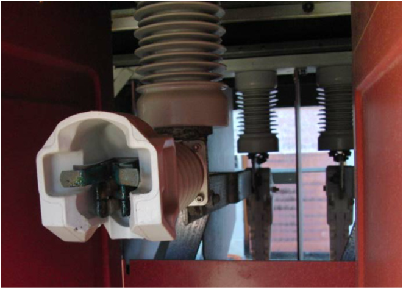
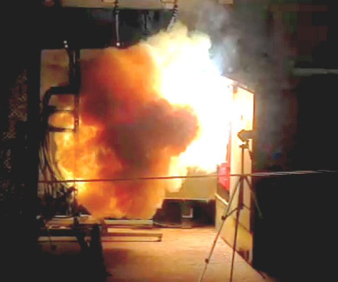

This app models the arc flash incident energy based on tests of PMH
padmounted switches by EPRI and PG&E. For more information, see
EPRI 1022697 [2011] and Short and Eblen [2012].

## Notes

The incident energy in this equipment is higher than predicted by
IEEE 1584 because of horizontal busbars.
Magnetic fields from the arc current push the arcs and arc energy out
of the enclosure towards the worker. This equipment is also unusual in
that the incident energy is not linear with duration--the heat rate
increases with increasing duration. Here is a picture of the
horizontal busbars along with a video frame from an arc flash test:

  

    
  

  

    
  

## References

[EPRI 1022697](http://www.epri.com/abstracts/Pages/ProductAbstract.aspx?ProductId=000000000001022697),
*Distribution Arc Flash: Phase II Test Results and Analysis*, Electric
Power Research Institute, Palo Alto, CA, 2011.

Short, T. A. and Eblen, M. L., "Medium-Voltage Arc Flash in Open Air
and Padmounted Equipment," *IEEE Transactions on Industry Applications*,
vol. 48, no. 1, pp. 245-253, Jan.-Feb. 2012.
[Approved version](//distributionhandbook.com/papers/ieee_repc_arc_flash_tshort_meblen_2011_IAS_submission.pdf)

